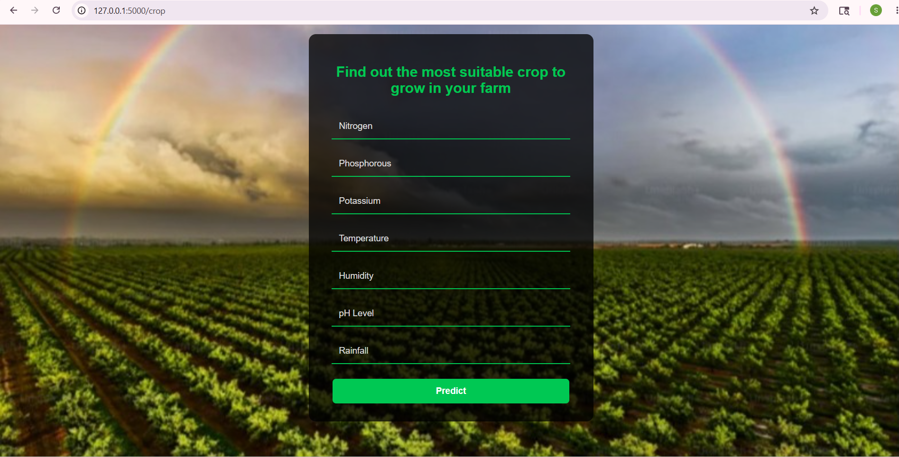
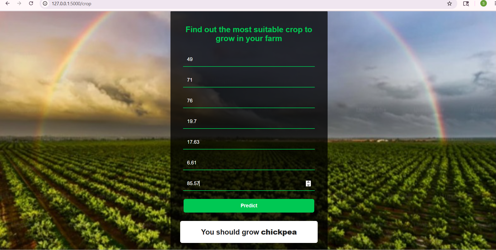

### Machine Learning Based Crop Recommendation System with Developed GUI

### About the Project

This project is a Machine Learning-based Crop Recommendation System designed to help farmers identify the most suitable crop for cultivation based on soil and environmental conditions.

The system analyzes important agricultural parameters such as Nitrogen (N), Phosphorus (P), Potassium (K), pH level, temperature, humidity, and rainfall to generate crop recommendations. A user-friendly web interface was developed using Flask, HTML, and CSS to make the system accessible and easy to use.

## Screenshots

### Home Page

### Login Page

### Input Form

### Recommendation Result

### Published Research Work

This project is based on the research work published in:
An Experimental Analysis of Machine Learning Techniques for Crop Recommendation, Nigerian Journal of Technology (NIJOTECH), 2024.

**Publication Link:** https://nijotech.com/index.php/nijotech/article/view/3486

### Results

The Crop Recommendation System was trained and evaluated using multiple machine learning algorithms, including Random Forest, Decision Tree, XGBoost, and K-Nearest Neighbors (KNN).

The experimental analysis showed that the Random Forest algorithm achieved the best performance, outperforming the other evaluated models.

**Performance Highlights**

- Random Forest achieved an accuracy of 99.3% with an F1-score of 99.01%.
- After hyperparameter tuning, the Random Forest model achieved an improved accuracy of 99.5%.
- The model successfully predicts suitable crops based on soil nutrients and environmental conditions.
- The system provides fast and reliable crop recommendations through an interactive web-based interface.
- The project demonstrates the practical application of machine learning in precision agriculture and decision support systems for farmers.

These results validate the effectiveness of machine learning techniques for crop recommendation and highlight the potential of the developed system in supporting modern agricultural practices.

### Future Enhancements

- Integration of real-time weather data.
- Mobile application development.
- Multi-language support for farmers.

### Author
Sushma Sri Miryala
